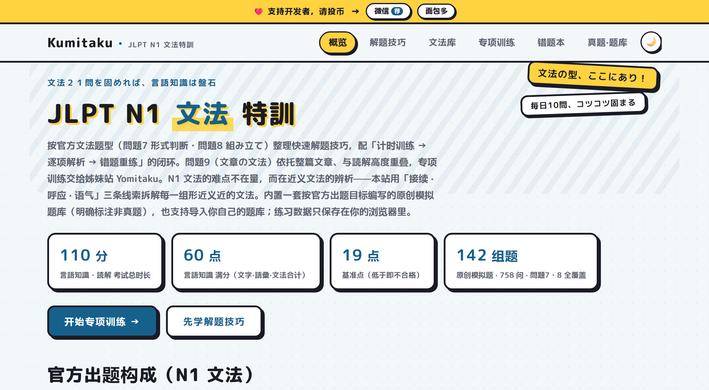
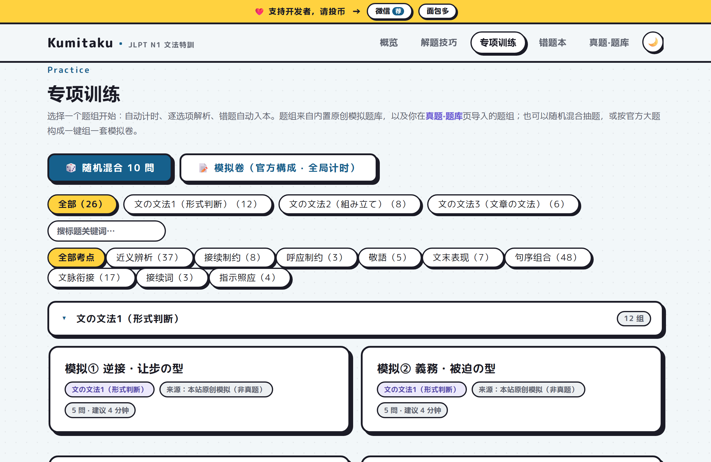
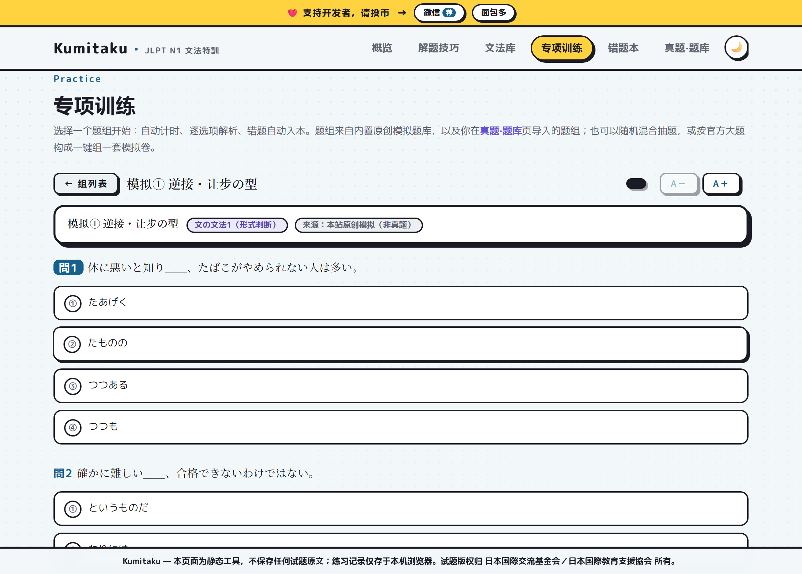
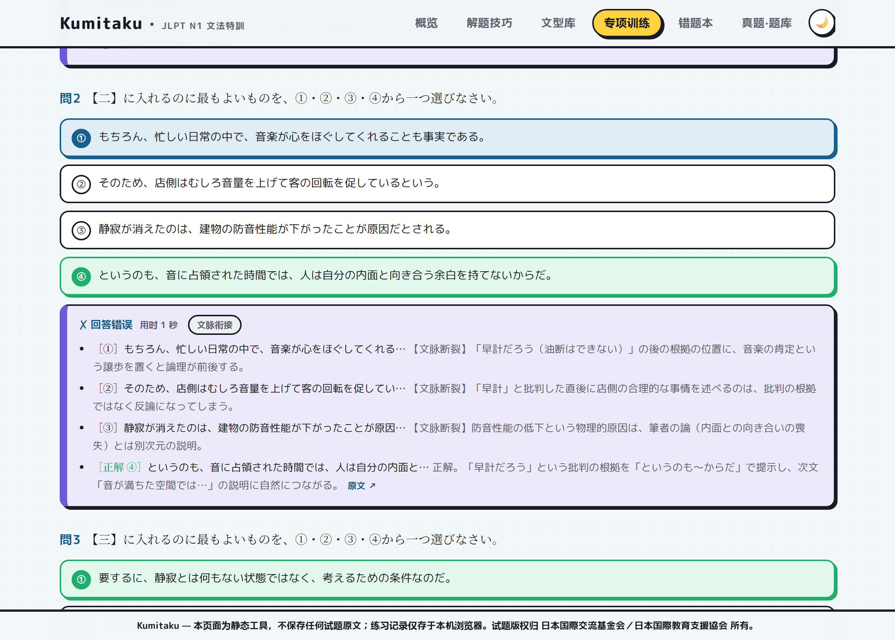
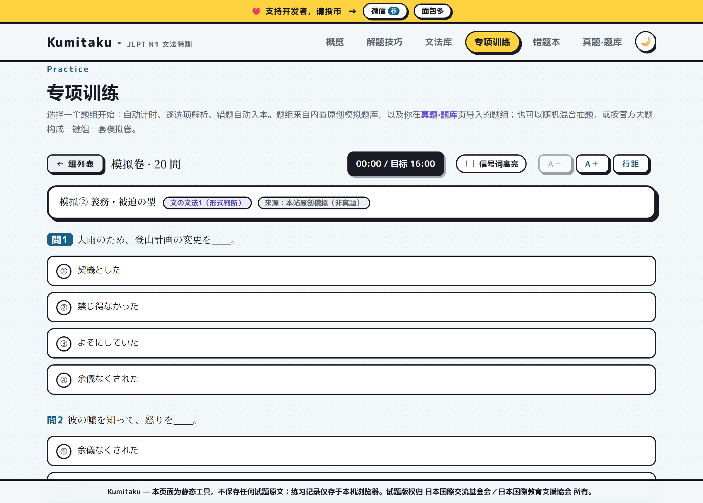
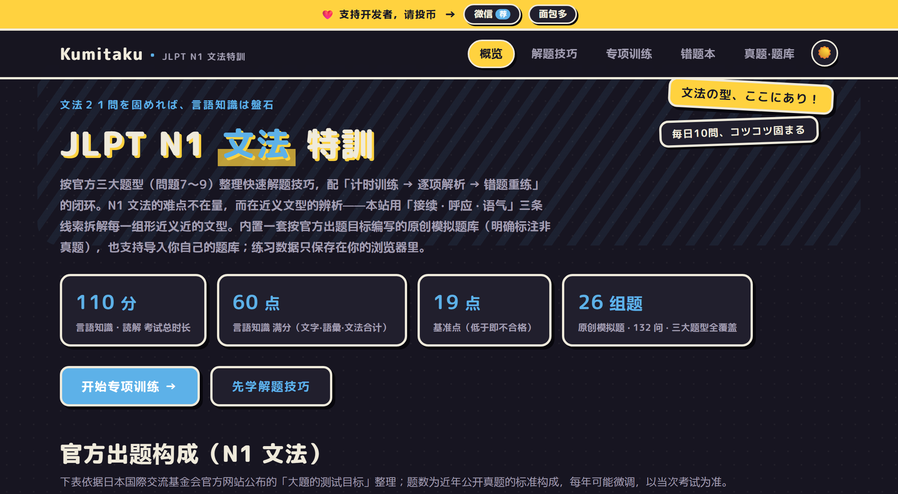
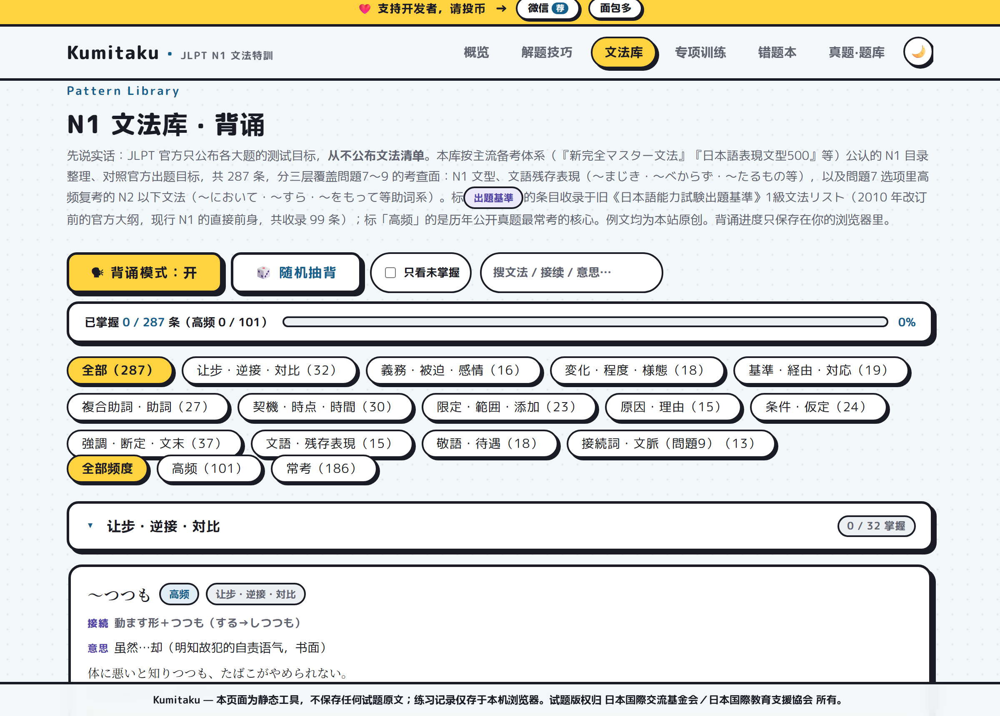

<div align="center">


# Kumitaku

**A lean, hardcore JLPT N1 文法 (grammar) trainer — near-synonym discrimination, timed practice, per-option explanations and a mistake notebook, all in one static page**

[](https://mocas-12.github.io/jlpt-n1-Kumitaku/)
[](https://developer.mozilla.org/en-US/docs/Web/JavaScript)


**[🌐 Live Preview (GitHub Pages)](https://mocas-12.github.io/jlpt-n1-Kumitaku/)**

*Open the page → learn the tactics → timed practice → per-option explanations → re-drill your mistakes*

**English** | [简体中文](./README.zh-CN.md) | [日本語](./README.ja-JP.md)

</div>

---

## 📖 Table of Contents

- [Features](#-features)
- [Screenshots](#️-screenshots)
- [The Naming](#-the-naming)
- [Training Loop](#-training-loop)
- [Question Bank & Copyright](#-question-bank--copyright)
- [Project Structure](#-project-structure)
- [Quick Start](#-quick-start)
- [Development](#-development)
- [Question Bank JSON Format](#-question-bank-json-format)
- [FAQ](#-faq)
- [Privacy & Security](#-privacy--security)
- [License](#-license)

## ✨ Features

- 🧭 **Organized by official question types**: mapped against the JLPT official《大題的測試目標》, it covers all three grammar sections — 問題7 文の文法1 (grammar-form judgement), 問題8 文の文法2 (sentence assembly / 統整文), 問題9 文の文法3 (discourse grammar)
- ⚡ **Quick tactic library**: three-line elimination (接続 connection · 呼応 co-occurrence · 语气 register), a 28-pattern quick reference grouped by near-synonym families, a seven-category trap checklist, and a 110-minute time budget
- 🗂 **Pattern library with recite mode (文法库)**: 287 entries covering the full N1 surface — N1 patterns, literary relics (〜まじき・〜べからず), and the compound particles / N2-carryover forms that keep reappearing in 問題7 options — each with its connection rule, meaning, an original example sentence with translation, near-synonym notes, a high-frequency flag (101 exam hot list) and a 出題基準 badge (99 entries verified against the pre-2010 official《日本語能力試験出題基準》1級 grammar list); **recite mode** hides the meaning until you click, marks patterns as mastered with localStorage progress, offers random pick-drilling, and links every pattern to its same-family drill set
- ⏱️ **Timed practice**: each set carries a per-question time budget with a real-time timer; overtime is flagged in red, reproducing exam pacing
- 🔍 **Per-option explanations**: every distractor is labelled with its trap type (接続不合 / 近義混同 / 呼応衝突 / 時態錯位 / 文体不合 / 語序違反 / 文脈断裂) and the key explains the pattern's connection, co-occurrence and register — not just an answer key
- 🔁 **Mistake-notebook loop**: wrong answers are collected automatically; correct answers push items down the 1→3→7-day spaced-repetition schedule until they graduate; a weak-point profile links straight into targeted drills
- 📊 **Per-type stats**: accuracy progress bars per question type + practice history + daily streak
- 🎲 **Mixed drill & mock exam**: one tap to shuffle 10 random questions, or assemble a 20-question mock following the official 問題7〜9 blueprint with a global timer
- 📥 **Extensible question bank**: paste JSON / upload a file to import your own sets (same ID auto-overwrites); an AI transcription prompt is included for converting your textbooks
- 📴 **Installable & offline (PWA)**: web manifest + a minimal service worker — add to home screen and keep drilling with no network
- 🌓 **Dark mode**: follows the system preference with a one-click toggle — the indigo washi theme re-tuned for night reading
- ⌨️ **Keyboard answering**: press 1–4 to pick options, Enter to submit
- 📝 **Session draft**: unsubmitted progress survives refreshes and tab closes
- 🧳 **Record backup**: export/import accuracy stats, history and the mistake notebook as JSON
- 💾 **Zero backend**: all data lives only in your browser's localStorage — double-click and it works

## 🖼️ Screenshots

| Overview | Practice entries |
| --- | --- |
|  |  |
| **Question in progress** | **Discourse grammar with passage & explanations** |
|  |  |
| **Mock exam (official blueprint)** | **Dark mode** |
|  |  |
| **Pattern library (recite mode)** | |
|  | |

## 🏷️ The Naming

**Kumitaku（組みたく）** — from *kumitai*, "want to assemble". It is the sibling of [Yomitaku](https://github.com/Mocas-12/jlpt-n1-Yomitaku)（読みたく, "want to read"）: same rhythm, same *〜たい* word formation, and it lands exactly on the official name of 問題8 — **文の組み立て**, sentence assembly. Reading trains you to take sentences apart; grammar trains you to put them together.

The visual identity keeps the manga-washi card language of Yomitaku, swapping the vermilion (朱) for indigo (藍) — a classic Japanese pairing.

## 🔁 Training Loop

```
技巧库（接続・呼応・语气 三线排查 + 高频文法速查）
        ↓
专项训练（26 组原创题 · 计时 · 键盘作答）
        ↓
逐选项解析（干扰项陷阱归类 + 正解三要素说明）
        ↓
错题本（1 → 3 → 7 天间隔重复，三轮答对毕业）
        ↓
弱点画像 → 定向重练 → 模拟卷检验
```

## 📚 Question Bank & Copyright

The built-in bank is **26 sets / 132 original questions** (clearly marked as non-past-paper mocks): 60 form-judgement items grouped by near-synonym families (逆接・讓步, 義務・被迫, 敬語 …), 48 sentence-assembly items in the exact official ＊-slot format, and 24 discourse-grammar items over six original passages.

JLPT past papers are copyrighted by Japan Foundation / JEES and commercial prep books by their authors. This site ships none of them. To drill with your own books, transcribe questions into the JSON format and import them on the 真題·題库 page — an AI transcription prompt is provided for one-paste conversion.

## 📂 Project Structure

```
├── index.html               # single-page app (5 hash-routed sections)
├── css/style.css            # indigo manga-washi theme (light/dark)
├── js/app.js                # all interaction logic (no framework, file:// friendly)
├── js/bunkei.js             # pattern library data (287 patterns, 13 categories, 出題基準 verified)
├── js/bank/                 # built-in question bank shards (pure data)
│   ├── core.js              #   shared header + window.BANK
│   ├── bun1.js              #   問題7 形式判断 ×12 sets / 60 items
│   ├── kumi.js              #   問題8 組み立て   ×8 sets / 48 items
│   └── sho.js               #   問題9 文章の文法 ×6 sets / 24 items
├── scripts/                 # dev tooling (zero-dep node scripts)
│   ├── check-bank.mjs       #   bank structure & quality validation (npm run check)
│   ├── version.mjs          #   content-hash asset fingerprinting + SW cache busting
│   ├── make-assets.mjs      #   OG banner + PWA icons (needs Playwright)
│   ├── make-screenshots.mjs #   README screenshots
│   └── update-docs.mjs      #   sync bank-size numbers into READMEs
├── tests/                   # Playwright smoke tests (19 scenarios)
├── public/                  # logo / icons / OG banner / support QR
└── .github/workflows/       # CI: bank check → smoke test → deploy to Pages
```

## 🚀 Quick Start

- **Online**: open [the live site](https://mocas-12.github.io/jlpt-n1-Kumitaku/), add it to your home screen, drill offline.
- **Local**: clone and double-click `index.html` — it just works (`file://` supported).

## 🛠️ Development

```bash
npm install          # dev-only dependency: Playwright
npm run check        # validate the question bank (structure, answers, distribution)
npm test             # run the 19 smoke scenarios against a local server
npm run hash         # rewrite asset ?v= hashes + SW cache name
npm run assets       # regenerate OG banner / icons (needs Chromium)
node tests/server.mjs 8322   # serve locally, then node scripts/make-screenshots.mjs
```

CI (`.github/workflows/static.yml`) validates the bank, runs the smoke tests, fingerprints assets and deploys to GitHub Pages — a merge only goes live when tests are green.

## 📋 Question Bank JSON Format

```jsonc
[
  {
    "id": "wb2018-q7-1",              // unique ID; re-import overwrites
    "typeKey": "bun1",                // bun1 | kumi | sho
    "title": "公式問題例 問題7",
    "source": "公式問題例PDF（2018）", // optional
    "sourceUrl": "https://www.jlpt.jp/samples/sample2018/pdf/N1G.pdf", // optional
    "minutes": 4,
    "questions": [                    // bun1: no passage, sentence lives in q
      { "q": "台風の接近に＿＿、出発を一日早めた。",
        "label": "近义辨析",
        "options": ["にあたって", "にひきかえ", "に即して", "に限って"],
        "answer": 0,                  // 0..3
        "explain": ["正解。…", "【接続不合】…", "【近義混同】…", "【呼応衝突】…"] }
    ]
  },
  { "id": "wb2018-q8-1", "typeKey": "kumi", "title": "…", "minutes": 4,
    "questions": [
      { "q": "田中さんは　＿＿・＿＿　＊＿＿・＿＿　帰国したそうだ。", // ＊ = target slot
        "label": "句序组合",
        "options": ["三年ぶりに", "海外勤務を", "終えて", "ようやく"],
        "answer": 0, "explain": ["…", "…", "…", "…"] } ] },
  { "id": "wb2018-q9-1", "typeKey": "sho", "title": "…", "minutes": 4,
    "passage": "文章正文……【一】……【二】……【三】……【四】……",
    "questions": [
      { "q": "【一】に入れるのに最もよいものを、①・②・③・④から一つ選びなさい。",
        "label": "文脉衔接",
        "options": ["完整选项句1", "完整选项句2", "完整选项句3", "完整选项句4"],
        "answer": 2, "explain": ["…", "…", "…", "…"] } ] }
]
```

## ❓ FAQ

<details>
<summary><b>Is the built-in bank real past-paper content?</b></summary>
No. Every question is an original mock written against the official test goals and marked 本站原创模拟（非真题）. Past papers are copyrighted and are not included or distributed.
</details>

<details>
<summary><b>How does this relate to Yomitaku?</b></summary>
Same author, same training loop, same design family — Yomitaku covers 読解 (reading, 問題10〜12 of the reading section), Kumitaku covers 文法 (問題7〜9 of the language-knowledge section). Drill grammar here, then take your time budget over to Yomitaku for reading.
</details>

<details>
<summary><b>Where is my progress stored?</b></summary>
Only in your browser's localStorage. Nothing is uploaded. Use the backup export/import on the bank page to move browsers.
</details>

## 🔒 Privacy & Security

- No backend, no analytics, no tracking; all practice data stays in localStorage.
- Imported source URLs are restricted to http(s); legacy entries with other schemes are neutralized at render time.
- The service worker only caches same-origin assets; Google Fonts requests are passed through untouched.

## 📄 License

[MIT](./LICENSE) © 2026 Mocas-12

Question copyright belongs to 日本国際交流基金会 / 日本国際教育支援協会（JEES） and the respective prep-book authors; this project contains no copyrighted question text.
